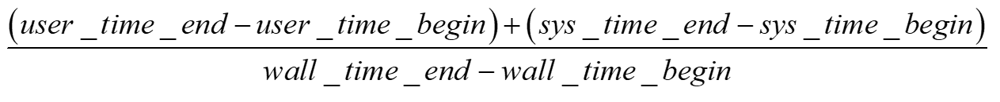

[**🇨🇳 中文**](README_CH.md) | [**🇬🇧 English**](README.md)

# 目 录

* [开始](#开始)
  * [编译PDB](#编译pdb)
  * [使用pdb-cli](#使用pdb-cli)
  * [兼容REDIS](#兼容redis)
* [核心功能](#核心功能)
  * [数据结构](#数据结构)
  * [批量处理](#批量处理)
  * [持久化](#持久化)
    * [落盘](#落盘)
    * [持久化数据加载](#持久化数据加载)
  * [主从同步](#主从同步)
    * [全量同步](#全量同步)
    * [增量同步](#增量同步)
* [性能测试](#性能测试)
  * [echo QPS](#echo-qps)
  * [Reactor/Ntyco/io_uring QPS](#reactorntycoio_uring-qps)
  * [DPDK性能测试](#dpdk性能测试)
  * [持久化](#持久化-1)
  * [主从同步](#主从同步-1)
  * [批量处理](#批量处理-1)
  * [内存](#内存)
  * [相关测试脚本/代码](#相关测试脚本代码)
* [优化思路](#优化思路)
  * [strcmp/printf/strlen](#strcmpprintfstrlen)
  * [网络层优化](#网络层优化)
    * [用户态缓冲区](#用户态缓冲区)
    * [recv/send调用时机(批量I/O处理 VS 单次I/O处理)](#recvsend调用时机批量io处理-vs-单次io处理)
    * [RESP协议](#resp协议)
    * [DPDK用户态协议栈（F-stack）](#dpdk用户态协议栈f-stack)
  * [主从同步](#主从同步-2)
  * [持久化](#持久化-2)
  * [底层数据结构](#底层数据结构)
* [TODO](#todo)

# 开 始

## 编译PDB

* **Ubuntu 20.04**

1. **安装依赖**

   ```shell
   # linux kernal: 5.15.0 or higher
   # clang version: 10.0.0-4ubuntu1
   
   # cmake and gcc
   # CMake 3.16.3 or higher is recommended.
   # gcc 9.4 or highter is recommended
   
   # RDMA dependencies
   sudo apt install -y rdma-core libibverbs-dev librdmacm-dev ibverbs-providers ibverbs-utils rdmacm-utils
   
   # io_uring dependencies
   git clone git@github.com:axboe/liburing.git
   cd liburing
   ./configure
   make -j$(nproc)
   sudo make install
   sudo ldconfig
   
   # ebpf dependencies
   sudo apt install -y clang llvm libelf-dev libbpf-dev gcc-multilib
   sudo apt install -y linux-tools-common linux-tools-$(uname -r)
   
   #jemalloc dependencies
   sudo apt install libjemalloc-dev
   
   apt install libreadline-dev
   ```
   

**Note**：我们提供了脚本（**./usertools/pdb_check_environment.sh**）去检查当前环境能否满足PDB运行条件。如果这个脚本输出“NO RDMA DEVICES FOUND”，说明当前环境没有初始化RDMA网卡或者没有RDMA网卡。我们提供了脚本来初始化RDMA软仿环境（**./usertools/init_rdma.sh**），运行该脚本可以完成Soft-RoCE环境的初始化。

2. **下载、编译PDB源码并运行PDB**

   ```shell
   git clone https://github.com/dai-yakai/PatronusDB.git
   cd PatronusDB
   make
   ./PatronusDB
   ```

3. **DPDK用户态协议栈**

   我们将F-stack（https://github.com/F-Stack/f-stack）移植到了PDB中，如果需要将内核的协议栈替换为用户态协议栈，请执行以下步骤：

   - **Step1：挑选一块网卡，让这个网卡被DPDK管理**。注意，被挑选的网卡将会被down掉，无法再用作ssh连接等功能。
   
     ```shell
     ip link set eth0 down
     modprobe vfio
     echo 1 > /sys/module/vfio/parameters/enable_unsafe_noiommu_mode
     modprobe vfio-pci
     ./dpdk-devbind.py -b vfio-pci [被挑选网卡对应的PCI地址]
     ```
   
     ```shell
     # 一种设置示例如下：
     root@test:/home/PatronusDB/usertools# ./dpdk-devbind.py --status
     Network devices using kernel driver
     ===================================
     0000:03:00.0 'VMXNET3 Ethernet Controller 07b0' if=eth0 drv=vmxnet3 unused=vfio-pci *Active*
     0000:0b:00.0 'VMXNET3 Ethernet Controller 07b0' if=eth1 drv=vmxnet3 unused=vfio-pci *Active*
     ........
     ========================
     
     # 命令输出了PCI地址，将其作为参数传入
     root@test:/home/PatronusDB/usertools# ./dpdk-devbind.py -b vfio-pci 0000:03:00.0
     ```
     
   - **Step2：编译F-stack并运行pdb-server**
   
     ```shell
     make clean
     make USE_DPDK=1
     ./pdb-server
     ```

## 使用pdb-cli

我们开发了命令行工具pdb-cli去和pdb服务端进行通信，用户可以在pdb-cli中输入命令与pdb服务端进行交互。pdb-cli的使用方法如下：当pdb server启动后，用户可以在另外一个终端执行以下命令：

```shell
cd client
make
./pdb-cli [server ip] [server port]
```

## 兼容REDIS

PDB完全兼容RESP格式的消息，Redis的交互工具同样可以操作PDB：

- **redis-cli**: 用户可以使用redis-cli与pdb服务端进行交互；
- **redis-benchmark**: 用户可以使用redis-benchmark测试pdb的性能；
- **hiredis**: 用户可以使用C语言的hiredis库操作pdb。

我们提供了**hiredis/redis-benchmark**与pdb交互的示例程序：

- ./test/hiredis_example.c：使用hiredis库测试了所有pdb的命令；
- ./test/benchmark_test.sh：使用benchmark测试了pdb set指令的qps。

# 核心功能

## 数据结构

PDB提供了array/hash/rbtree三种基本结构存储键值对，同时提供了Bitmap/Set/Sorted Set三种高级数据结构供用户使用。此外，PDB还将C风格的字符串封装为了SDS。

- **Array/Hash/Rbtree**：
- **Bitmap**：
- **Set**：
- **Sorted Set**：
- **SDS**：

## 批量处理

- 批量处理命令格式：以HMSET（hash批量插入）为例，RHSET RK_1 RV_1 RK_2 RK_2 ... RK_N RV_N。其对应的RESP格式为

```C
*2N+1\r\n
$4\r\n
RSET\r\n
$4\r\n
RK_1\r\n
$4\r\n
RV_1\r\n
......
$4\r\n
RK_N\r\n
$4\r\n
RV_N\r\n
```

服务端收到该命令后，循环解析

## 持久化

### 落盘

1. **增量数据持久化落盘**：程序维护一个持久化上下文结构体，结构体包含：增量缓冲区、增量缓冲区游标（指向缓冲区当前可写的idx）、文件fd、时间戳（上一次将缓冲区数据罗盘的时间）。当程序处理完一条命令后，如果这条命令符合增量，就会将这条命令以RESP格式写入增量缓冲区中。在主循环中，程序在每次事件之前，都会检查增量缓冲区是否有数据，如果有数据，首先检查落盘是否超时（当前时间戳减去上一次落盘的时间戳），如果超时，则触发后续的落盘逻辑，如果没有超时，则继续检查增量缓冲区数据长度是否超过阈值，如果超过，则触发后续的落盘逻辑。

   PDB会根据当前增量缓冲区的长度分配一块内存快照，将增量缓冲区中的内容拷贝到新分配的快照中，随后获取一个sqe，并将这个快照挂载到sqe上，随后向io_uring提交写事件，最后更新增量缓冲区游标和时间戳。在主循环中，每次处理事件之前，利用io_uring_for_each_cqe检查是否有sqe完成，如果有，则将挂载到sqe中的快照内存释放。

2. **全量数据持久化落盘**：PDB打开一个文件并调用，随后调用调用ftruncate，撑大这个文件，预分配足够大的虚拟存储空间，接着通过 mmap 将该文件的内核页缓存直接映射到用户态的虚拟内存地址空间中（只有当程序操作这块虚拟内存的时候，CPU 发现这个虚拟地址没有对应的物理内存，于是触发一个“缺页中断”。操作系统介入，立刻在物理内存中分配一个 4KB 的真实物理页，并映射给这个虚拟地址，同时在物理磁盘上真正分配 4KB 的区块。程序写多少，它才真实消耗多少物理空间）。随后，程序依次遍历内存里所有的全局数据结构（如红黑树、哈希表），按照既定的二进制协议将节点数据连续序列化并直接“赋值”进这块映射内存中——这使得海量数据的落盘变成了纯粹的内存指针操作。待所有结构写入完毕后，通过msync强制操作系统将这些脏页刷入物理硬盘介质，最后调用ftruncate将文件精准截断至实际写入的大小并追加结束符（EOF）。

### 持久化数据加载

首先探测目标RDB文件的真实大小，并利用mmap将该磁盘文件以只读（PROT_READ）和私有映射（MAP_PRIVATE）模式完整地挂载到用户态的虚拟内存地址空间中，使其化身为一个巨大的连续字符数组；随后，PDB通过维护一个内存偏移量指针（offset）在此映射区内顺序滑动，依次读取结构标识码（opcode），并以此为路由信标，将内存指针直接传递给哈希表、数组或红黑树的底层反序列化函数，将二进制字节流原位还原为活动的数据结构节点；

PDB将繁重的“磁盘拉取（read系统调用）”转变为“纯内存指针顺序遍历”，降低了内核缓冲区到应用缓冲区的内存拷贝开销，仅依赖操作系统底层的缺页中断按需将物理磁盘页载入内存，从而完成了全量数据库状态的恢复。

## 主从同步

### 全量同步

我们提供了两种全量同步的方式（RDMA和sendfile），并比对了二者的性能。用户可以通过修改配置文件中的`is_rdma`选项进行切换。

- rdma全量同步过程（单边读取）
  - **步骤1 主从建立socket连接** 用户修改配置文件中的`is_slave`项，将当前节点标记为slave节点。用户还需要在配置文件中给出master节点的ip(`master_ip`)和port(`master_port`)。slave节点上线后，根据配置文件中的master ip和master port，与master节点建立socket连接。
  - **步骤2 主从建立RDMA通信信道（master侧）**：socket连接建立成功后，slave节点通过socket fd向master节点发送“ZSYN”。master收到后，分配一块内存，内存大小由 `PDB_RDMA_MEMPOOL_SIZE` 定义。分配成功后，master节点将这块内存注册到rdma网卡上，允许slave节点通过rkey远程访问master的这块内存。master节点创建CQ和QP，并将QP类型设置为`IBV_QPT_RC`，QP状态设置为INIT。完成上述资源的初始化后，master节点将vaddr（内存池的起始虚拟地址）、rkey（远程访问密钥）、size（内存池大小）、LID/GID、每一个QP的QPN和PSN以RESP的格式，通过socket fd发送给slave节点。
  - **步骤3 主从建立RDMA通信信道（slave侧）**：slave节点收到master节点发送的RDMA连接信息后，首先分配一块内存区域，master的全量数据将会被拉去到这块内存区域中。随后，创建QP和CQ，并通过调用ibv_modify_qp，将master传过来的PSN/QPN、rkey、LID/GID等信息写入QP的上下文中并将QP的状态进行转移：INIT -> RTR -> RTS。完成上述操作后，salve节点将LID/GID/QPN/PSN以RESP格式，通过socket fd发送给slave节点。
  - **步骤4 全量数据搬运**：slalve节点调用 `ibv_post_send` 发起 `IBV_WR_RDMA_READ` 请求
  - **步骤5 临时RDMA资源回收**。

### 增量同步

PDB维护一个主从连接上下文结构体，结构体维护了一个静态fd链表（本质是一个静态数组）。处理完一次命令后，会检测该命令是否为增量命令，如果是，则会遍历所有主从连接fd，将这条命令以RESP形式写入每个fd的write缓冲区中，最后将这个fd对应的事件设置为EPOLLOUT。当下一次事件循环的时候，增量就会被发送给slave节点。

# 性能测试

## echo QPS

1. **测试方法**：测试redis和pdb的极限echo QPS。在测试过程中会调整batch/pipelin -p的数量，从而测得极限echo QPS

   - 使用redis-benchmark测试redis echo极限qps；

   - 客户端发送PING，服务端仅回复PONG。客户端需发送100w个PING命令，每4096个PING命令组成数据包发送给服务端，由此测得QPS。
2. **测试结果**：

|         |   redis   | PatronusDB |
| :-----: | :-------: | :--------: |
| **QPS** | 2,767,567 | 4,483,902  |

## Reactor/Ntyco/io_uring QPS

1. **测试方法**：测试不同网络框架（reactor/ntyco/io_uring）不同内存模型（malloc/jemalloc/mempool）下，各个数据结构的QPS。对于每种数据结构，测试SET/ADD命令的QPS。对于每个命令，客户端需要发送100w条。客户端每次发送时，将4096条命令拼接成数据包进行发送。
2. **测试结果**：

* **Reactor**

| 内存模型 | RBTree | Hash | Array | Set | Sorted set | Bitmap |
|  :--:  | :--:  | :--: |  :--:  |  :--:  |  :--:  |  :--:  |
| malloc | 417,536 | 515,198 | 32258 | 587,889 | 449,842 | 865,051 |
| mempool | 519,750 | 694,444 | 34482 | 729,394 | 453,103 | 821,692 |
| jemalloc | 549,450 | 700,770 | 30303 | 751,879 | 467,508 | 815,660 |


* **Ntyco**

| 内存模型 | RBTree | Hash | Array | Set | Sorted set | Bitmap |
|  :--:  | :--:  | :--: |  :--:  |  :--:  |  :--:  |  :--:  |
| malloc | 170,823 | 237,812 | 31250 | 220994 | 144571 | 214,546 |
| mempool | 171,644 | 239,635 | 32258 | 308261 | 131856 | 222,667 |
| jemalloc | 151,308 | 311,817 | 33333 | 229147 | 142877 | 263,019 |

* **io_uring**

| 内存模型 | RBTree | Hash | Array | Set | Sorted set | Bitmap |
|  :--:  | :--:  | :--: |  :--:  |  :--:  |  :--:  |  :--:  |
| malloc | 674763 | 884,173 | 27777 | 977517 | 419111 | 929368 |
| mempool | 695894 | 832,639 | 28571 | 1233045 |   533049   | 1101321 |
| jemalloc | 675219 | 916,590 | 28571 | 826446  | 614628 | 831255 |

## DPDK性能测试

**小包场景**：对比测试大规模小包场景下的PPS和吞吐量：对比测试了redis、pdb（运行Linux协议栈）、pdb（运行F-stack协议栈）

```shell
# 测试命令
memtier_benchmark -s 192.168.137.221 -p 8888 -t 8 -c 100 --test-time=60 -d 1 --pipeline=1 --command="PING"
```

|       性能维度        | redis  | PDB（内核协议栈） | PDB（F-stack用户态协议栈） |
| :-------------------: | :----: | :---------------: | :------------------------: |
|        **QPS**        | 11,148 |      17,031       |           36,878           |
| **吞吐量（KB/sec）**  |  457   |        698        |           1,512            |
|  **平均延迟（ms）**   | 71.74  |       46.95       |           21.67            |
| **P99 长尾延迟 (ms)** | 413.69 |      305.15       |           68.60            |

## 持久化

1. **RDB** :

   - **测试方法**：客户端共发送100w条HSET命令，分别测试4种情况下的QPS：每隔1000条命令中间插入一条SAVE指令，测试QPS；每隔1w条命令中间插入一条SAVE指令，测试QPS；每隔10w条命令中间插入一条SVAE指令，测试QPS；每隔100w条命令中间插入一条SAVE指令，测试QPS。
   - **测试结果**：

   |         |  1000   |   1w    |   10w    |   100w   |
   | :-----: | :-----: | :-----: | :------: | :------: |
   | **QPS** | 928,505 | 995,024 | 1157,407 | 1275,510 |

2. **AOF**：

    - **测试方法**：对比测试pdb aof和redis aof的性能。客户端发送100w条HSET命令，分别测试未开启aof的qps，开启aof但未采用异步方式的qps，开启aof但采用io_uring方式的qps。redis客户端发送100w条HSET命令，分别测试未开启aof的qps，开启aof的qps。
    - **测试结果**：
    
    |   PDB   |   echo    |  no aof   |   aof   | aof(io_uring) |
    | :-----: | :-------: | :-------: | :-----: | :-----------: |
    | **QPS** | 4,483,902 | 1,387,604 | 254,841 |    989,119    |
    
    |  Redis  |   echo    | redis aof | redis no aof |
    | :-----: | :-------: | :-------: | :----------: |
    | **QPS** | 2,767,567 |  318,522  |   497,636    |

## 主从同步

- **RDB replication(VMware)**

  **1. 测试环境**：网卡的标称物理带宽是10Gbps，MTU设置为4200，内存8G，4核CPU，运行在VMware虚拟环境中，主从节点运行在同一个虚拟网段下。

  **2. 测试方法**：

  - **使用RDMA方案的同步时间**：在调用ibv_post_send之前使用gettimeofday，将当前时间戳记录在t_begin，当ibv_poll_cq返回值大于0且轮询到的wc状态是IBV_WC_SUCCESS时，将当前时间戳记录在t_end，同步时间为t_end - t_begin。

  - **使用RDMA方案的CPU使用率**：测试的是master节点CPU使用率。在调用ibv_post_send之前使用gettimeofday，将当前时间戳记录在wall_time_begin，随后调用getrusage，将当前的CPU用户态时间和CPU内核态时间分别记录在user_time_begin和sys_time_begin中。当调用ibv_poll_cq确保数据全部获取成功后，再次调用gettimeofday，将当前时间戳记录在wall_time_end中，调用getrusage，将当前CPU用户态时间和CPU内核态时间分别记录在user_time_end和sys_time_end中，CPU使用率的计算方法为：

    

  - **使用sendfile方案的同步时间**：在需要同步的数据开头插入BEGIN_RDB，末尾插入END_RDB，分别记录从节点收到BEGIN_RDB的时间戳和END_RDB的时间戳，两个时间戳相减获得主从同步时间。

  - **使用sendfile方案的CPU使用率**：测试的是master节点（发送端）CPU使用率。主节点在调用sendifle之前，调用gettimeofday将当前时间戳记录在wall_time_begin，随后调用getrusage，将当前的CPU用户态时间和CPU内核态时间分别记录在user_time_begin和sys_time_begin中。当sendfile将全部数据发送成功后，再次调用gettimeofday，将当前时间戳记录在wall_time_end中，调用getrusage，将当前CPU用户态时间和CPU内核态时间分别记录在user_time_end和sys_time_end中，CPU使用率的计算方法为：

    

  **3. 测试结果**：

  | Data size |  500M  |   1G   |   2G    |
  | :-------: | :----: | :----: | :-----: |
  | sendfile  | 5867ms | 8959ms | 16912ms |
  |   rdma    | 2089ms | 3510ms | 9658ms  |

  | Data size | 500M  |   1G   |   2G   |
  | :-------: | :---: | :----: | :----: |
  | sendfile  | 7.89% | 38.61% | 27.58% |
  |   rdma    | 0.12% | 0.06%  | 0.03%  |

- **RDB replication(eRDMA)**

  **测试环境**：我们在阿里云平台的2台云主机（均包含eRDMA环境）中部署了PDB的主节点和从节点，主从节点的实例规格相同，均为ecs.g9i.large：2核CPU、8G内存、eRDMA网卡的标称物理带宽是25Gbps、MTU设置为4200。主从节点在同一个可用区，连接在同一个虚拟交换机下。
  
  **测试方法**：测试方法同VMware。
  
  **测试结果**：
  
  | 时延/数据大小 | 500M  |  1G   |   2G   |
  | :-----------: | :---: | :---: | :----: |
  |   sendfile    | 482ms | 924ms | 1820ms |
  |     rdma      | 242ms | 512ms | 1050ms |
  
  | CPU使用率/数据大小 | 500M  |  1G   |  2G   |
  | :----------------: | :---: | :---: | :---: |
  |      sendfile      | 5.16% | 5.35% | 5.70% |
  |        rdma        | 0.02% | 0.01% | 0.01% |


  * **AOF replicaition**

    该部分分别测试了redis开启aof和不开启aof的set命令qps，pdb开启aof和不开启aof的HSET命令qps。其中，redis开启aof的配置为：`appendfsync no`。测试结果如下：

    | pdb  | aof replication | no replication |
    | :--: | :-------------: | :------------: |
    | QPS  |     809,279     |   1,921,844    |

    | redis | aof replication | no aof replication |
    | :---: | :-------------: | :----------------: |
    |  QPS  |    1,205,542    |     1,675,414      |

## 批量处理

我们对比了PDB批量处理命令（HMSET）的QPS和redis-benchmark pipeline模式下的QPS。测试共计发送100w条HMSET命令，其中，每条HMSET的测试命令如下：

```shell
# PDB HMSET
HMSET HK_1 HV_1 HK_2 HV_2 ... HK_BATCH_NUM HV_BATCH_NUM
```
redis-benchmark的测试命令如下：
```shell
# redis-benchmark
./redis-benchmark -t set -n 1000000 -c 1 -P BATCH_NUM -q
```

BATCH_NUM的数量分别为1000、5000、10000，对比结果如下：

|   Batch Num    |   1000    |   5000    |   10000   |
| :------------: | :-------: | :-------: | :-------: |
|      MSET      | 2,008,032 | 2,036,659 | 2,096,436 |
| Redis Pipeline | 1,838,235 | 1,964,636 | 1,949,888 |

## 内存

1. **测试方法**：我们分别使用malloc、jemalloc和mempool来测试pdb的内存性能，同时分别使用两个工具测试了pdb内存性能：

   - **使用valgrind工具运行pdb**，测试过程如下：插入2条并删除1条，并循环100w次，随后删除2条，插入1条，并循环100w次。测试结束后，观察报告，找到峰值和谷值并记录。每次循环的指令如下：

   ```shell
   # 每次循环插入2条并删除1条，循环100w次，每次循环的命令如下：
   RSET RK_i RV_i
   RSET RKK_i RVV_i
   RDEL RKK_i RVV_i
   
   # 每次循环删除2条，插入1条，循环100w次，每次循环的命令如下：
   RSET RKK_i RVV_i
   RDEL RK_i RV_i
   RDEL RKK_i RVV_i
   ```
   
   - **使用htop命令**，测试过程如下：在运行pdb之前，使用htop指令观察初始状态的mem。随后插入2条并删除1条，并循环100w次，观察此时htop指令的mem。最后删除2条，插入1条，并循环100w次，循环完后，再记录此时htop指令的mem。每次循环测试的指令同valgrind。


2. **测试结果**（malloc）：

   * **htop**: 

     |       | init  | peak  | valley |
     | :---: | :---: | :---: | :----: |
     | value | 1.84G | 2.13G | 2.13G  |

   * **Valgrind Massif**: 

     |  |  total(B)   | useful-heap(B) | extra-heap(B) |
   |  :--:  | :--:  |  :--:  |  :--:  |
   | peak value | 307,218,912 | 207,968,907 | 99,250,005 |
   | valley value | 41,159,224 |   39,656,975   | 1,502,249 |

  2. **测试结果**（jemalloc）

     * **htop**: 

       |       | init  | peak  | valley |
       | :---: | :---: | :---: | :----: |
       | value | 1.81G | 2.02G | 2.02G  |

     - **Valgrind Massif**: 

          |              |  total(B)   | useful-heap(B) | extra-heap(B) |
          | :----------: | :---------: | :------------: | :-----------: |
          |  peak value  | 221,218,336 |  156,460,703   |  64,757,633   |
          | valley value | 40,122,536  |   38,878,873   |   1,243,663   |

  3. **测试结果**（mempool）

     * **htop**：

       |       | init  | peak  | valley |
       | :---: | :---: | :---: | :----: |
       | value | 1.69G | 1.88G | 1.88G  |

     * **Valgrind Massif**：

       |              |  total(B)   | useful-heap(B) | extra-heap(B) |
       | :----------: | :---------: | :------------: | :-----------: |
       |  peak value  | 230,879,608 |  230,837,899   |    41,709     |
       | valley value | 230,879,568 |  230,837,869   |    41,699     |

## 相关测试脚本/代码

1. **redis-benchmark：./test/redis-benchmark.sh：利用redis-benchmark测试pdb/redis一发一收的性能**

   ```shell
   ./redis-benchmark [server ip] [server port]
   ```

2. **hiredis：利用hiredis库测试pdb所有命令功能**

   ```shell
   ./pdb_hiredis [server ip] [server port]
   ```

3. **对比测试redis-pipeline和PDB batch处理**

   ```shell
   # redis-pipeline
   ./test_redis_pipeline.sh [redis server ip] [redis server port] [BATCH NUM] [PDB server ip] [PDB server port]
   # PDB batch
   ./pdb_test_mset [server ip] [server port] [BATCH NUM]
   ```

4. **测试所有数据的QPS**

   ```shell
   ./pdb_test_all_data_qps [server ip] [server port]
   ```

5. **测试PDB和redis极限echo QPS**

   ```shell
   ./test_redis_pipeline.sh [redis server ip] [redis server port] [BATCH NUM] [PDB server ip] [PDB server port]
   ```

# 优化思路

## strcmp/printf/strlen

- **strcmp**：

  - 旧思路：将当前接收到的命令和pdb所有支持的命令进行循环strcmp，时间复杂度是$O(N^2)$。

  - 优化思路：首先获取接收到的命令的第一个字符，利用switch case语句匹配对应首字符，随后在每一个case中去strcmp当前首字母开始的所有潜在命令。假如接收到的命令是HSET，则需要比对的命令如下：

    ```C
    char cmd_first = cmd[0];
    switch cmd_first
    {
        case 'H':
            {
                if (strcmp(cmd_str, "HMSET") == 0)  return PDB_CMD_HMSET;
                if (strcmp(cmd_str, "HMGET") == 0)  return PDB_CMD_HMGET;
                if (strcmp(cmd_str, "HSET") == 0)   return PDB_CMD_HSET;
                if (strcmp(cmd_str, "HGET") == 0)   return PDB_CMD_HGET;
                if (strcmp(cmd_str, "HDEL") == 0)   return PDB_CMD_HDEL;
                if (strcmp(cmd_str, "HMOD") == 0)   return PDB_CMD_HMOD;
                if (strcmp(cmd_str, "HEXIST") == 0) return PDB_CMD_HEXIST;
                if (strcmp(cmd_str, "HSETEX") == 0) return PDB_CMD_HSETEX;
                break;
            }
    }
    ```

    程序只需要比对H开头的潜在命令，不要去strcmp pdb所有支持的命令。

- 数据结构比对字符串时需要调用strcmp(例如红黑树)：将strcmp改为数值比对，可以根据字符串计算哈希值，将字符串的比对改为hash值的比对。

- **strlen**：

  - 旧思路：获取字符串长度的时候直接调用strlen()
  - 优化思路：实现SDS，SDS首先具有一个头部，头部后面是字符串内容，头部中有一部分区域存储字符串的长度。SDS创建完毕后，将指针移动到字符串的第一个字符，将移动后的指针返回给用户。当用户需要获取字符串长度的时候，首先将字符串指针向前移动到存储字符串长度的起始地址，随后直接读取这个地址里的值就可以获得字符串长度。

- **printf**：

  - 旧思路：对于需要输出的日志，直接printf在终端中。

  - 优化思路：设置日志级别，根据日志级别对printf进行封装。pdb共设置了3个级别的日志（info、debug、error），将printf封装成3个函数:

    ```C
    #define pdb_log_debug(fmt, ...) \
        _pdb_log_debug_impl(__FILE__, __LINE__, __func__, fmt, ##__VA_ARGS__)
    
    
    #define pdb_log_info(fmt, ...) \
        _pdb_log_info_impl(__FILE__, __LINE__, __func__, fmt, ##__VA_ARGS__)
    
    
    #define pdb_log_error(fmt, ...) \
        _pdb_log_error_impl(__FILE__, __LINE__, __func__, fmt, ##__VA_ARGS__)
    
    ```

    用户可以像使用printf一样去使用3个log函数。在配置文件中，用户可以通过设置log_level选项来控制哪些日志可以被输出。在每个_pdb_log_debug_impl的内部，可以调用第三方异步日志库，使得日志可以被异步写入文件中。

## 网络层优化

### 用户态缓冲区

- **接收端缓冲区**：采用**线性动态缓冲区**。数据库启动后，会调用pdb_malloc初始化一块缓冲区（堆上分配的内存），缓冲区的长度是PDB_PROTO_IO_BUFFER_LENGTH（16K）缓冲区的数据结构是SDS。如果当前收到的命令塞满了整个缓冲区，并且这个命令不完整（半包），就会触发缓冲区扩容，扩容策略是原有长度的基础上乘1.5。在epoll_wait超时触发时设置一个事件：检测当前缓冲区是否有较长的剩余空间（当前缓冲区的长度 - PDB_PROTO_IO_BUFFER_LENGTH），如果有较长的剩余空间，就会触发缩容机制，将缓冲区的长度缩减为PDB_PROTO_IO_BUFFER_LENGTH。

  - **为什么不采用环形缓冲区/链式缓冲区？**

    **接收缓冲区的核心需求是：快速扫描并解析RESP格式的消息**。采用线性缓冲区可以提高命令解析的效率。PDB采用的命令格式是RESP格式，RESP格式采用\r\n来定界，如果采用链式缓冲区，当前chunk里面没有\r\n，就需要去下一个chunk里面搜索\r\n，提高了解析的复杂度。同理，对于环形缓冲区，如果命令回绕，需要重新分配一块连续空间，将回容命令放到这个连续空间里面进行解析，降低了解析效率。

- **发送端缓冲区**：采用**定长缓冲区+链式混合式缓冲区**。

  - **做法**：在连接上下文中维护两个指针，一个指向静态固定长度的数组，数组内存由堆分配，长度大小为PDB_PROTO_IO_BUFFER_LENGTH，一个指针指向链表的头节点，每一个链表节点代表一个chunk块，链表节点由两部分组成：指向下一个链表的指针、指向需要发送的数据、游标（如果当前chunk没有发送完毕，游标指向下次需要发送的初始位置）。每一个chunk块下面挂载的需要发送的数据大小限制为PDB_PROTO_IO_BUFFER_LENGTH。PDB使用**writev()**发送发送缓冲区内的数据。当需要发送链式缓冲区的数据时，PDB首先初始化一个iovec结构体数组，随后检查定长缓冲区是否有需要发送的数据，如果有，将其当作iovec[0]，随后遍历链式缓冲区中的数据，将有效数据的指针（从游标开始）和长度放入iovec[i]中，最后调用writev()将链式数据一次推入内核中。

  - **为什么采用混合式的缓冲区？**

    **发送缓冲区的核心需求是：将响应发往网络**。PDB响应内容长度的方差极大，例如，如果用户发送的命令是SET，PDB只需要响应OK；如果用户发送的命令是MGET或者GET一个很大的value（20M的博客），此时需要很长的缓冲区。故需要一个能够动态变化长度的缓冲区设计。相较于线性动态缓冲区，定长缓冲区+链式缓冲区方案的优势如下：**1. 内存利用率高**。当需要返回的响应长度有100M，一次send只能发送前10M数据，如果此时采用线性数组，一般为了避免调用memmove，会采用游标法，此时游标指向10M的位置，下次调用send的时候从游标位置处开始发送，由于是连续内存，前面10M数据无法释放，如果采用链式缓冲区，可以直接释放当前已经成功发送的chunk块。 **2. 有利于零拷贝。**如果value本身在PDB中占用50M的内存，如果采用线性连续缓冲区，需要把这个value拷贝到缓冲区中，而如果采用链式缓冲区，可以直接将这个value的指针挂载到chunk块下，避免了一次拷贝。

- **四种用户态缓冲区的使用场景**：

  - **线性定长缓冲区**：
  - **线性动态缓冲区**：
    - 长度完全不可预测、方差极大的输入数据流；
    - **依赖物理内存的绝对连续性来进行高速单向扫描**；
    - 例如：读取变长的HTTP Heade 或庞大的JSON载荷时（nginx），需要连续内存保证正则表达式解析和状态机转移的高效性。
  - **环形缓冲区 ring buffer** ：
    - 在单生产者-单消费者（SPSC）的并发模型下，如果生产和消费的数据不对等，**对操作缓冲区的时延有极高要求**。
    - 例如，ebpf采用ring buffer。如果ebpf采用链式缓冲区，每次捕获到内核事件时，eBPF 都去调用底层的内存分配函数来创建链表节点，这在不可中断的上下文（如NMI，不可屏蔽中断）中会直接引发内核崩溃；如果XDP停下来等用户态消费，整台服务器的网络瞬间就会瘫痪。
  - **链式缓冲区**：
    - **在需要动态扩容的情况下，对内存使用率有极高要求**。
    - **可以利用零拷贝**
    - 例如，sk_buffer。使用sendfile() 系统调用，想要把磁盘上的一个 1MB 的图片发给客户端。内核读取图片到内存的页缓存（Page Cache）后。sk_buff 根本不拷贝这些数据，它只是在自己的 frags 数组中，新增几个指针，直接指向页缓存中那些物理页的地址。

### recv/send调用时机(批量I/O处理 VS 单次I/O处理)

1. **如何避免频繁调用recv**

   首先调用SDS的接口获取当前接收缓冲区剩余空闲长度，recv需要传入期望接收数据的长度，直接将接收缓冲区剩余空闲长度传参给recv。一次尽可能接收较多的数据。

2. **如何避免频繁调用send**

   recv完成后，调用process_read_buffer（）,将接收到的RESP消息进行扫描解析，当整个接收缓冲区全部解析完成后，直接调用send，将发送缓冲区中的内容发送出去。

   - **避免了频繁调用set_event**；
   - **避免单次IO处理卡住的情况**：如果采用批量发送的逻辑，当用户采用ping-pong式的客户端逻辑时（用户每次只发送一条命令，等到单条命令的响应返回来时，再发送下一条命令），会导致客户端和服务端卡住的现象。当用户只发送一条命令，由于服务端发送缓冲区有效长度不满足预定义的阈值，服务端不会返回响应给客户端；对于客户端，由于一直没有接收到服务端的响应，就会一直处于等待状态。

3. **如何避免频繁调用set_event**

   在整个连接的生命周期内，只有在刚调用完accept建立socket连接后，才会调用一次set_event，为这个fd注册EPOLLIN事件，后续每当处理完一次process_read_buffer（）后，就会直接调用send函数进行发送，无需将事件切换为EPOLLOUT。

### RESP协议

- **RESP的好处**：
  - **避免半包**：
    - **半包问题**：TCP只保证字节序的交付，不保留应用层的逻辑边界，当应用层发送的逻辑报文长度超过了MSS最大报文段大小或者由于网卡MTU的限制，一个完整的应用层协议包会被切分为多个链路层帧进行传输。从接收方的视角看，这意味着在单次 read 系统调用中，缓冲区仅能获取到逻辑报文的一部分碎片，导致应用层解析器无法通过预定义的结束符或长度标识还原出完整的报文上下文。
    - RESP是如何避免半包问题的：RESP引入了数组个数和长度前缀，即TCP 报文在传输层被切分，解析器仍能依据首部提供的长度信息准确判断当前读取进度，并在内存中维持未完成报文的上下文状态，直到累积字节数与预声明长度完全匹配。
  - **透明传输**：传统的以特定字符（如 \0 或换行符）作为结束标志的协议，无法传输包含这些字符的原始二进制数据，RESP是基于字符长度来确定编解的，所以消息内容可以是任意二进制数据。
  - **提供协议层面的安全性**：在多条查询（Arrays）格式中，参数的数量和每个参数的长度都是预先声明的。攻击者无法通过在数据中插入额外的 \r\n 来“切断”当前指令并开启一条新指令。RESP严格按照声明的长度读取，多余的内容会被视为协议错误或下一个独立的请求，有效规避了协议层面的指令注入。
- **RESP解析过程**：首先，它执行基础的防御性检查，确认当前缓冲区长度不少于4字节且首位标识为“*”，以过滤非法的或严重残缺的请求；接着，通过指针位移解析出数组的元素个数，并校验紧随其后的回车换行定界符。随后，代码进入基于元素数量的核心校验循环，逐个处理多块字符串：提取“$”标识后的载荷长度并更新最大载荷统计值，此时最关键的一步是，直接将当前游标加上预声明的载荷长度与尾部定界符的总跨度，将其与缓冲区末尾指针进行比对，若发生越界则立即判定为半包并中断解析让底层继续等待I/O，若未越界则直接让指针跨越该数据块，全程避免了低效的逐字扫描。最后，当循环完整结束时，说明当前内存区域已包含一个完整的命令结构，函数通过计算当前游标与起始地址的差值，返回该完整报文的总字节长度，从而指导上层网络框架精确地截取粘包数据并推进读取位移。

### DPDK用户态协议栈（F-stack）

- **如何移植DPDK进PDB中**：将DPDK初始化函数写入初始化数据库函数中（pdb_init_dpdk），写一个hook头文件（src/pdb_dpdk_hook.h），将posix API重定义为F-stack API，例如将socket函数define为ff_socket，将send函数define为ff_send。主循环仍然按照原来的逻辑，将主循环函数作为回调函数传入ff_run(pdb_dpdk_loop, NULL)。
- **相较于内核协议栈，用户态协议栈是如何提升性能**：
  - **轮询模式（PMD）替代硬件中断**：传统网卡收到数据包后，会向 CPU 发送一个硬件中断（IRQ），迫使 CPU 停下手中的活去处理网络包。DPDK会专门分配一个或多个CPU核心，被分配的CPU专门检测网卡，如果有包到来，就会立刻处理，中间不会产生中断。
  - **用户态驱动（VFIO）**：DPDK启动后，会把linux内核自带的网卡驱动卸载掉，替换为VFIO/UIO，这个新驱动会将网卡底层的寄存器地址映射到用户态，同时DPDK在用户态申请一大块连续的物理内存（大页内存），并告诉网卡的DMA，收到包后，直接将包放到这个大页内存中。用户态会启动一个死循环，循环内移指监控共享内存有没有数据写入。全程没有陷入内核态。
  - **无锁队列技术**：DPDK设计了基于CAS指令的无锁rte_ring队列。rte_ring中存放的是rte_mbuf指针。
- **DPDK可以带来什么样的性能提升？**：
  - **提高吞吐量，提高数据包处理率**：DPDK 则由用户态程序直接接管网卡，采用大页物理内存零拷贝和死循环轮询，干掉了所有中断、上下文切换和锁竞争，数据包像走“专线”一样直达应用层。
- **使用场景**：极高的并发连接、极小的有效载荷，以及对延迟（特别是 P99 长尾延迟）极度敏感。
  - **高频交易**：一笔交易指令或一条行情数据只有几十到一百多字节。但在极端行情下，一秒内会涌入数百万条指令；
  - **MMO游戏/FPS游戏**：玩家的移动坐标、鼠标朝向、开枪指令、技能释放。以硬核射击游戏（如 CS:GO 或 Valorant）为例，服务器的 Tickrate 通常为 64 或 128，意味着每个玩家每秒钟要与服务器进行64到128次极小数据包的交互；
  - **DNS/负载均衡**： DNS查询就是最经典的一发一收UDP小包。

## 主从同步

1. 主从连接fd的管理
   - 旧思路：预先分配一个静态数组，数组类型是conn_info，数组的index代表连接的fd，例如主节点与从节点之间连接的fd为6，则这个连接的上下文conn_info会被存储在数组下标为6的元素中。当需要将增量转发给从节点的时候，需要遍历整个静态数组，寻找有效的从节点fd。
   - 优化思路：将静态数组结构改为静态双向链表结构。数组类型依然是conn_info结构体，数组的index代表连接的fd，conn_info结构体维护两个fd，分别是前一个从节点的fd和后一个从节点的fd，同时需要维护两个全局变量global_conn_info_list_head和global_conn_info_list_tail，分别指向静态链表的头fd和尾fd。当用户需要遍历所有从节点的时候，只需要从global_conn_info_list_head开始访问数组，随后通过next_fd访问下一个从节点，直接循环的fd与global_conn_info_list_tail相等，则停止循环，不需要遍历整个数组。
2. 为什么采用RDMA而不是senfile？
   - **降低数据同步时间**：sendfile发送数据时，大量时间耗损在CPU处理内核协议栈上，RDMA 网卡内部有专门的 ASIC（专用集成电路）芯片。它不需要像 CPU 那样去“读取指令再执行”。生成包头、计算校验和的逻辑是直接被烧录成物理电路的。
   - **降低CPU使用率**：由于RDMA的异步特性，实际的内存跨总线读取与网络报文传输，由网卡硬件在后台通过DMA独立调度执行，期间完全无需 CPU 介入或进行上下文切换。
3. 什么是RDMA异步特性？RDMA异步特性会带来什么问题？如何解决？
   - **异步特性**：当应用程序通过调用Verbs API（如 ibv_post_send）提交工作请求时，CPU仅负责将任务描述符下发至网卡（RNIC）的工作队列并立即返回，该过程属于极低延迟的非阻塞式指令提交。实际的内存跨总线读取与网络报文传输，由网卡硬件在后台通过DMA独立调度执行，期间完全无需 CPU 介入或进行上下文切换。
   - **问题**：脏读写问题。如果应用层在收到完成队列事件（CQE）确认之前，误以为操作已结束而过早地覆写了 Send Buffer，网卡随后去拉取时就会将这份额外的、被污染的数据发送出去，造成“脏写”；同理，若在 Recv 接收或 RDMA READ 操作的 CQE 尚未产生前，业务线程就急于读取目标内存池，则会拿到硬件尚未完全覆盖的旧数据或残缺数据块，造成“脏读”，
   - **解决**：这种机制决定了系统调用的结束绝不代表物理传输的完成，底层数据缓冲区的生命周期因此与主程序的执行域严格剥离；应用程序必须通过主动轮询或中断监听机制，从完成队列（CQ）中获取网卡异步投递的完成事件（CQE），方能确认数据链路的最终闭环并安全回收内存资源。

## 持久化

1. **如何提高文件加载速度?**
   - **消除频繁的上下文切换**：如果采用传统的read()机制，在读取循环中，程序必须不断调用read()将文件中的数据读到缓冲区中进行解析。每一次read()调用都会引发一次代价高昂的用户态到内核态的上下文切换；
   - **缩减数据拷贝路径**：在常规的read()流程中，数据首先由DMA从磁盘拷贝到操作系统的页缓存中，然后 CPU 再将其从页缓存拷贝到应用层分配的缓冲区中。通过使用mmap并配合PROT_READ | MAP_PRIVATE，mapped_buf 实际上直接指向了操作系统内核的页缓存，中间少了一次拷贝过程（消除了 CPU 拷贝）。
2. **如何提高落盘的速度，不阻塞主循环？**
   - **全量数据落盘，fork子进程**：首先fork()一个子进程，利用写时复制机制，子进程瞬间获得了一个只读的、时间点绝对静止的内存快照，而主进程继续处理客户端的新请求。
   - **增量数据落盘，采用io_uring**：
     - **增量数据落盘的需求**：**1. 非阻塞**。主线程的核心任务是处理极高吞吐的网络请求。如果为了把几十个字节写进磁盘而调用write()，一旦遇到文件系统锁或内核脏页回写限流，主线程就会被无情挂起，引发整个数据库的严重延迟毛刺。**2. 极低的系统调用开销**。如果来一条命令就调用一次write()，高频的用户态/内核态上下文切换会影响服务端的QPS。3. **内存安全的异步解耦**。当主线程决定把数据交给内核后，必须能够立刻回头去处理新的客户端命令，而不用关心数据何时真正落到物理磁盘上。
     - **io_uring方案如何满足上述需求**：**1. 对于第一个需求**，io_uring在进行处理写事件的时候（调用io_uring_prep_write），只是把一个SQE放进了共享内存的环形队列中。随后调用io_uring_submit将事件提交后会立即返回。如果内核发现这次写入会产生阻塞（例如触发了脏页限流），内核会自动将该任务卸载到后端的内核异步工作线程池中处理，主循环不会发生阻塞。**2. 对于第二个需求**，利用共享内存和批处理。因为主循环和内核共享SQ/CQ环形队列，主线程可以在用户态填充多个写入请求，然后仅通过一次系统调用，将任务进行批提交。**3. 对于第三个请求**，io_uring允许调用io_uring_sqe_set_data挂载用户态的数据。主循环对增量缓冲区memcpy出一份快照缓冲区，并将指针交给io_uring（也就是调用io_uring_sqe_set_data，将快照挂载到io_uring的sqe上）。此时，这块内存的“控制权”在逻辑上移交给了内核。内核处理完后会向CQ放入完成条目。主循环在每一轮事件循环末尾，检查CQ并释放那块快照内存，从而实现了内存安全的闭环管理。
     - **为什么不采用fork方案**：**违背了第一个和第二个需求**。如果每次为了小规模增量就调用一次fork，会频繁的进行fork系统调用，fork的时候，会不断阻塞主循环，影响主循环处理网络IO请求。
   - 为了避免频繁调用io_uring_submit，采用批量提交的方式，当增量缓冲区的长度超过设定的值时，才会调用io_uring的相关系统调用提交事件。为了避免缓冲区长时间没有到达预定阈值的情况，设置了超时落盘的机制。在落盘的上下文中设置一个时间戳，时间戳记录上一次落盘时的时间戳，每次在调用落盘函数前，检测距离上次调用落盘函数是时间差是否超过了预先设定的值，如果超过了，则调用io_uring的相关系统调用，提交write事件。

## 底层数据结构

1. **hash表扩容的过程中会产生什么问题，如何解决？**

   问题：当hash表中存较多的数据，如果一次性全部进行rehash，会阻塞服务端，导致服务端QPS下降。

   触发扩容时会进行rehash，**采用渐进式rehash**。pdb_hash结构体中维护两个全局hash表，hash_table[0]为正常使用的hash表，hash_table[1]平时为空，当触发rehash时，才会具体分配内存。结构体中还维护一个rehash_idx，当rehash_idx为-1时，说明没有触发rehash，当rehash_idx为0后，触发rehash，开始搬运数据，rehash_idx代表当前需要搬运的槽位。每次搬运，会根据hash函数重新计算idx，并将rehash_idx对应的槽位下的链表全部搬运到hash_table[1]新的idx上。

   共有两部分代码会执行搬运操作：当pdb处理完用户命令后，会执行一次搬运过程（搬运链表，并向前移动rehash_idx）；定时器在处理完任务后，也会执行搬运过程。当rehash_idx==hash_table[0]的长度后，搬运过程停止。

   为了保证数据的一致性，当用户执行删除/修改/查找操作时，会先在hash_table[0]内进行删除/修改/查找，如果hash_table[0]没有回去hash_table[1]里面进行删除/修改/查找；当用户执行插入操作时，数据会全部被插入hash_table[1]中；

1. **rbtree优化？**

   每个树节点维护一个hash值，在进行查找节点时，为了尽可能不调用strcmp，先比对各个节点的hash值，只有当hash值一致的时候，才会去调用strcmp。

1. **字符串数据结构的优化（sds）**

   - **保证了二进制安全**：传统C字符串，根据\0字符的位置进行定界，如果需要用字符串存储一条数据，数据中包含大量\0字符，C的API会无法准确获取字符串的边界。SDS直接根据头部的len进行定界，无视了字符串具体存储的内容。
   - **优化C字符串的相关API**：
     - **优化了strlen**：直接在sds头部维护了字符串长度，不需要调用strlen就可以以$$O(1)$$的时间复杂度获取字符串长度；
     - **优化了strcat**：每次进行字符串拼接时，都必须重新向操作系统申请内存（realloc）；而SDS在初始化字符串时，会提前分配一定长度的空间，在进行字符串拼接的时候，如果剩余长度足够，就会直接在剩余长度处进行拼接，不会进行realloc。
   - **兼容了C的字符串**：在创建完SDS后，返回给用户的不是头部指针，而是指向存储字符串数据的首地址，同时，字符串的末尾还是为加入\0字符。

# TODO

* TODO1：主从全量同步不支持拉取2G以上数据，考虑采用“边序列化、边传输”的方案：
  *  Master 开始遍历数据结构，将键值对序列化并写入 Buffer 0
  *  当 Buffer 0 写满时，遍历操作暂停（记录下当前的游标 Cursor）。
  *  Master 通知 Slave：“Buffer 0 满了，来拉取”。
  *  Slave 发起 RDMA READ 拉取 Buffer 0。
  *  重叠期：在 Slave 拉取 Buffer 0 的同时，Master 根据刚才记录的游标，恢复遍历，继续把后续的数据序列化进 Buffer 1。
  *  循环交替，直到所有内存结构遍历完毕，写入一个 PDB_OPCODE_EOF。

- TODO2：给每个key添加缓存过期策略

- TODO3：加入渐进式rehash策略，对比测试渐进式rehash策略和直接全部rehash策略会对QPS产生什么影响

- TODO4：加入事件机制，完善定时器功能。

- TODO5：考虑直接将RDMA封装成一种网络框架（类似于reactor），测试其性能，目前想到的问题有如下：

  - RDMA在初始化时需要提前注册内存，注册后的内存在接收数据的过程中如何进行扩容？

  - 服务端注册的内存，能否会被多个连接同时写入数据？

  - 多个连接向服务端注册的内存写入数据，如何保证数据写入的安全性（当前连接写入的数据不会覆盖其他连接写入的数据），涉及同步问题，考虑用锁？

    
